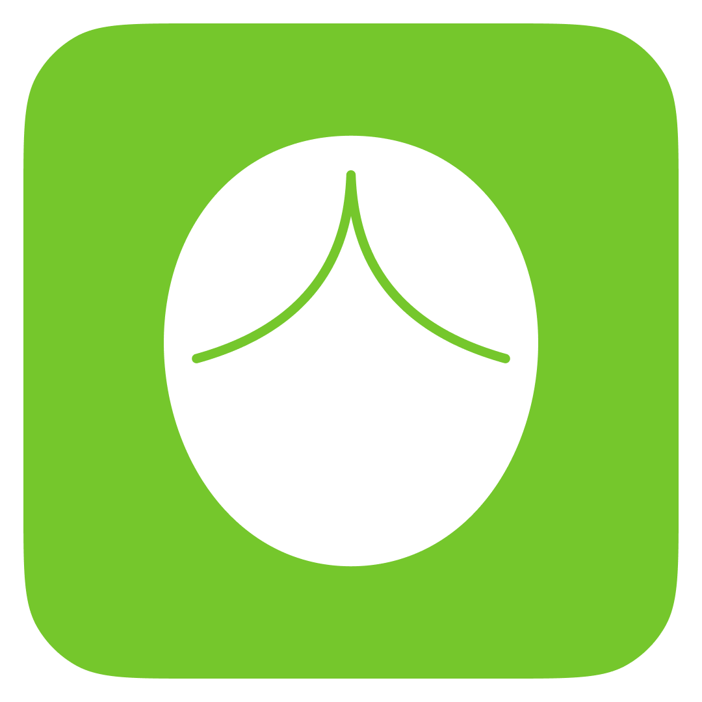

# 行为录制精灵 - 鼠标宏录制工具

<div align="center">



[](https://www.apple.com/macos/)
[](https://swift.org/)
[](LICENSE)

一款功能强大的 macOS 鼠标宏录制和播放工具，支持深色模式、自动保存、循环播放等功能。

</div>

## ✨ 功能特性

- 🎙️ **录制鼠标操作** - 精确记录鼠标移动、点击、拖拽和滚轮事件
- 💾 **自动保存** - 录制完成后自动保存，随时可以回放
- 📋 **宏管理** - 支持重命名、删除已保存的宏
- 🔄 **循环播放** - 支持单次播放、指定次数循环和无限循环
- 🌓 **深色模式** - 自动适配系统深色/浅色主题
- 🎨 **自定义图标** - 使用自定义应用图标

## 📦 安装方式

### 方式一：直接下载（推荐）

1. 下载最新的 `行为录制精灵.app`
2. 将应用拖动到「应用程序」文件夹
3. 首次运行时需要在「系统设置 > 隐私与安全性 > 辅助功能」中授予权限

### 方式二：从源码编译

```bash
# 克隆项目
git clone https://github.com/cxcboss/MacroRecorder.git
cd MacroRecorder

# 打包应用
chmod +x package_app.sh
./package_app.sh

# 应用已打包到 MacroRecorder.app
```

## 🚀 使用方法

### 1. 录制宏

1. 点击「开始录制」按钮
2. 执行你想要记录的鼠标操作
3. 点击「停止录制」
4. 输入宏名称并保存

### 2. 播放宏

1. 从左侧列表选择一个已保存的宏
2. 设置播放模式：
   - **指定次数**：设置循环次数（1-999次）
   - **无限循环**：持续循环播放
3. 点击「播放」开始执行

### 3. 管理宏

- **选择**：点击宏列表中的项目
- **重命名**：点击 ⋯ 按钮，选择「重命名」
- **删除**：点击 ⋯ 按钮，选择「删除」

## ⚙️ 系统要求

- macOS 13.0 (Ventura) 或更高版本
- 辅助功能权限（用于监听和模拟鼠标事件）

## 🔒 权限说明

本应用需要「辅助功能」权限来：
- 监听鼠标事件（录制）
- 模拟鼠标事件（播放）

> ⚠️ 首次运行时如遇到权限提示，请前往「系统设置 > 隐私与安全性 > 辅助功能」手动授予权限。

## 📁 项目结构

```
MacroRecorder/
├── MacroRecorderApp.swift     # 应用入口
├── ContentView.swift          # 主界面 UI
├── MacroViewModel.swift       # 业务逻辑
├── MacroModel.swift           # 数据模型
├── MacroStorageManager.swift  # 数据持久化
├── MouseRecorder.swift        # 鼠标录制核心
├── MousePlayer.swift          # 鼠标播放核心
├── Package.swift              # Swift 包配置
├── project.yml                # XcodeGen 配置
├── package_app.sh             # 打包脚本
└── Assets.xcassets/           # 应用图标资源
```

## 🛠️ 技术栈

- **语言**: Swift 5.9
- **框架**: SwiftUI, CoreGraphics, Carbon
- **构建工具**: Swift Package Manager
- **打包**: 自定义 Shell 脚本

## 📝 更新日志

### v2.0 (2025-01-30)

- ✨ 新增宏保存和管理功能
- ✨ 新增循环播放模式（单次/指定次数/无限循环）
- ✨ 支持深色模式自动适配
- 🎨 使用自定义应用图标
- 🐛 修复多项 bug 并优化性能

## 🤝 贡献指南

欢迎提交 Issue 和 Pull Request！

## 📄 许可证

本项目采用 MIT 许可证开源，详见 [LICENSE](LICENSE) 文件。

## 📧 联系方式

- GitHub: [@cxcboss](https://github.com/cxcboss)
- 项目地址: https://github.com/cxcboss/MacroRecorder

---

<div align="center">

**如果这个项目对你有帮助，请给我一个 ⭐ Star！**

</div>
